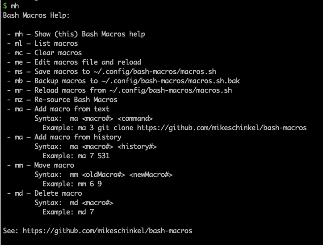

# Bash Macros 

Bash Macros is a simple _"macro"_ system for Bash.




## Usage Examples

With Bash Macros you can assign up to nine (9) commands — or capture them from `history` — into a command-line alias with a name from `m1`to `m9`.

For example, the following will assign `git log --oneline -20` to an alias named `m3`:

```
# Add `git log --oneline -20` as the alias `m3`
ma 3 "git log --oneline -20"    

# Display the alias to ensure it worked
alias m3

# Run `git log --oneline -20` with the macro      
m3

# List the macros you currently have      
ml

# Save the macros to ~/.config/bash-macros/macros.sh      
ms

# Clear the macros from memory      
mc

# List again to see you have none      
ml

# Reload macros from  ~/.config/bash-macros/macros.sh     
mr

# List a third time to see that the `m3` macro was reloaded.      
ml
```


## Platform
Bash Macros was developed and tested on vanilla Debian 11 Linux running Bash v5.1.4; it may or may not work on any other environment.

## Prerequisites

You must have [Git](https://git-scm.com/) installed and in your `$PATH`.

## Installing

From your Bash terminal command line, run this command:

```
source <(curl -sL https://raw.githubusercontent.com/mikeschinkel/bash-macros/v1.0.1/install.sh)
```

Here is a [**link to the installer**](https://raw.githubusercontent.com/mikeschinkel/bash-macros/v1.0.1/install.sh) for your pre-installation inspection.

## To Uninstall

From your Bash terminal command line, run this command:

```
bash_macros_install
```
OR
```
rm -rf ~/.config/bash-macros
```
Then restart your session to clear macros from your environment.

## Pull Requests
I will consider accepting PRs to add features and/or to allow it to support other platforms, assuming I have access to the platform and/or can create a VM to test in.

However, I may not be able to process PRs quickly, depending on my current workload.


## License

- [MIT](LICENSE)